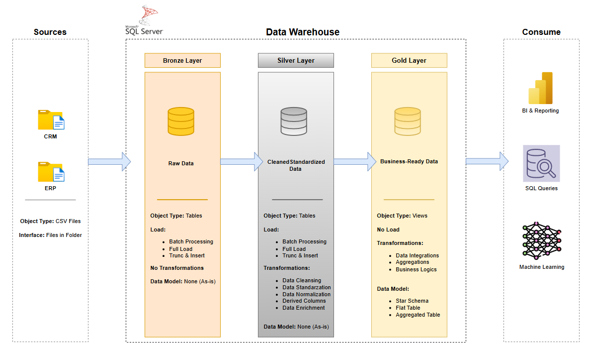

# Data Warehouse Project

Welcome to the **SQL Data Warehouse Project** repository! 

This repository contains a comprehensive data warehousing solution built with SQL Server, demonstrating ETL processes, dimensional modeling, data quality validation and analytics queries for transforming raw data into actionable business insights.
 
---

## 📖 Project Overview

This project involves:

- **Data Architecture**: Designing a Modern Data Warehouse Using Medallion Architecture **Bronze**, **Silver**, and **Gold** layers.
- **ETL Pipelines**: Extracting, transforming, and loading data from source systems into the warehouse.
- **Data Modeling**: Developing fact and dimension tables optimized for analytical queries.
 
---

## 🏗️ Data Architecture

The data architecture for this project follows Medallion Architecture **Bronze**, **Silver**, and **Gold** layers:


- **Bronze Layer**: Stores raw data as-is from the source systems. Data is ingested from CSV Files into SQL Server Database.
- **Silver Layer**: This layer includes data cleansing, standardization, and normalization processes to prepare data for analysis.
- **Gold Layer**: Houses business-ready data modeled into a star schema required for reporting and analytics.

---

## 📝 Project Requirements

### ⚒️ Building the Data Warehouse (Data Engineering)

#### Objective
Develop a modern data warehouse using SQL Server to consolidate sales data, enabling analytical reporting and informed decision-making.

#### Specifications
- **Data Sources**: Import data from two source systems (ERP and CRM) provided as CSV files.
- **Data Quality**: Cleanse and resolve data quality issues prior to analysis.
- **Integration**: Combine both sources into a single, user-friendly data model designed for analytical queries.
- **Scope**: Focus on the latest dataset only; historization of data is not required.
- **Documentation**: Provide clear documentation of the data model to support both business stakeholders and analytics teams.

---

## 📂 Repository Structure

```
sql-data-warehouse-project
|
+---datasets                                  # Raw datasets used for the project (ERP and CRM data)
|   +---source_crm
|   |       cust_info.csv
|   |       prd_info.csv
|   |       sales_details.csv
|   |
|   \---source_erp
|           CUST_AZ12.csv
|           LOC_A101.csv
|           PX_CAT_G1V2.csv
|
+---docs                                     # Project documentation and architecture details
|       architecture.png                     # The project's architecture
|       datacatalog.md	                     # Catalog of datasets, including field descriptions and metadata              											 						  
|       data_flow.png                        # The data flow diagram
|       data_model.png                       # Data models (star schema)
|       integration_model.png                # How tables are related and integrated
|       naming_conventions.md                # Consistent naming guidelines for tables, columns, and files
|
+---scripts                                  # SQL scripts for ETL and transformations
|   |   init_database.sql                    # Script for creating database and schemas
|   |
|   +---bronze_layer                         # Scripts for extracting and loading raw data
|   |       bronze_ddl.sql                   # Script creates tables in the bronze schema
|   |       proc_load_bronze.sql             # Stored procedure script loads data into the bronze schema
|   |
|   +---gold_layer                           # Scripts for creating analytical models
|   |       gold_ddl.sql                     # Script creates views for the Gold Layer in the data warehouse
|   |
|   \---silver_layer                         # Scripts for cleaning and transforming data
|           proc_load_silver.sql             # Stored procedure performs the ETL process to populate the silver schema tables from the bronze schema
|           silver_layer_ddl.sql             # Script creates tables in the silver schema
|
\---tests                                    # Test scripts and quality files
        quality_checks_gold.sql
        quality_checks_silver.sql
|
|   .gitignore                              # Files and directories to be ignored by Git
|   LICENSE                                 # License information for the repository
|   README.md                               # Project overview and instructions
```

---

## 🛠️ Important Tools:

- **[Datasets](datasets/):** Access to the project dataset (csv files).
- **[SQL Server Express](https://www.microsoft.com/en-us/sql-server/sql-server-downloads):** Lightweight server for hosting your SQL database.
- **[SQL Server Management Studio (SSMS)](https://learn.microsoft.com/en-us/sql/ssms/download-sql-server-management-studio-ssms?view=sql-server-ver16):** GUI for managing and interacting with databases.
- **[DrawIO](https://www.drawio.com/):** Design data architecture, models, flows, and diagrams.

---

# Simple How to Use Step-by-Step Instructions

## ✅ Quick Setup & Run

### Step 1: Install Required Tools

- **SQL Server** (Express, Standard) is the **recommended tool** for this project.
- You can use any _Relational Database Management System_ (RDBMS) you prefer, but you may need to modify some parts of the scripts if your environment is different. Some scripts might not run perfectly on other SQL platforms without changes.
- For easiest setup, download and install:
  - **SQL Server Express** (free): https://www.microsoft.com/en-us/sql-server/sql-server-downloads
  - **SQL Server Management Studio (SSMS)**: https://learn.microsoft.com/en-us/sql/ssms/download-sql-server-management-studio-ssms

### Step 2: Clone the Repository
```bash
git clone https://github.com/junnuvain10/sql-data-warehouse-project.git
cd sql-data-warehouse-project
```

### Step 3: Open the SQL Scripts
1. Open **SSMS**
2. Connect to your SQL Server instance

### Step 4: Run Scripts in Order

Execute these SQL scripts in **SSMS** in this exact order:

1. **Create Database & Schemas:**
   - Open and run: `scripts/init_database.sql`

2. **Create Bronze Layer (Raw Data):**
   - Open and run: `scripts/bronze_layer/bronze_ddl.sql`
   - Open and run: `scripts/bronze_layer/proc_load_bronze.sql`

3. **Create Silver Layer (Clean Data):**
   - Open and run: `scripts/silver_layer/silver_layer_ddl.sql`
   - Open and run: `scripts/silver_layer/proc_load_silver.sql`

4. **Create Gold Layer (Analytics):**
   - Open and run: `scripts/gold_layer/gold_ddl.sql`

### Step 5: Verify Everything Works
Run the quality check scripts:
- `tests/quality_checks_silver.sql`
- `tests/quality_checks_gold.sql`

If all scripts run **without errors**, you're done! ✅

---

## 📊 What You Now Have

- **Bronze Layer**: Raw data from CSV files (ERP & CRM)
- **Silver Layer**: Cleaned and standardized data
- **Gold Layer**: Ready-to-use analytics tables for reporting

That's it! You can now query the Gold layer for business insights.

---

## 🛡️ License

This project is licensed under the [MIT License](LICENSE). You are free to use, modify, and share this project with proper attribution.

## 🙏 Credits

Special thanks to _Baraa Khatib Salkini_ (also known as [Data With Baraa](https://www.youtube.com/@DataWithBaraa)) for this project idea. This project helped me to learn and understand how to build a Data Warehouse from a scratch, how ETL process works and what is dimensional modeling in practise. In addition to all of this, I also learned how to document a project in a proper way. This experience gives me a solid base and a good starting point for my projects in the future.

## 🌟 About Me

I am a student who is currently studying for Bachelor's degree in Business Information Technology at University of Applied Sciences and will specialize in data engineering. 
